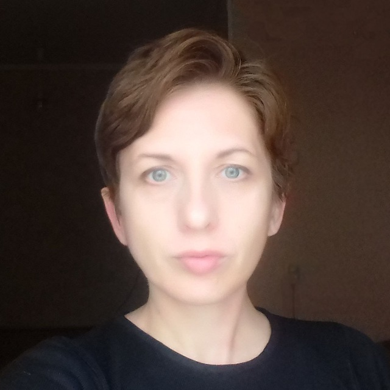

 
# Darya Hvozdzeva 
## Junior Frontend Developer
### Contact information:
### phone +375 29 2834908 
### e-mail darya.hvozdzeva@gmail.com 

SKILLS

* HTML5, CSS3
* JavaScript Basics
* Git, GitHub
* VS Codе

LANGUAGES

* Russian - Mother tongue
* English – Conversational

WORK EXPERIENCE

March 2018 – Present
Social Media Evaluator (Freelance contract)
Appen
Analyze and tag social media content based on provided criteria to collect training data for machine learning.

October 2015 - December 2017
Data Analyst (Remote)
itsolution.expert, Dnipro, Ukraine
•	Retrieved data from database, Google Аnalytics, and other sources.
•	Provided data analysis using MS Excel and other analytics tools.
•	Interpreted data to identify key metrics.
•	Created reports and dashboards.

June 2013 – September 2017 
Freelance translator
Worked freelance for translation agencies and direct clients such as Booking.com, LLC "BTD Neotech" (translation agency, Moscow, Russian Federation), Logrus (translation agency, Moscow, Russian Federation), Gengo (online translation services).
Translated various publications and documents from English to Russian, provided website localization. 

Jul 2008 – January 2013
IT Support Engineer
 JSC "Plant of Electrical products", Lida
Provided IT support to company personnel.

EDUCATION

Engineer degree in Information Systems and Technologies (in Economics), 2004-2010
Belarusian State University of Informatics and Radioelectronics, Minsk
